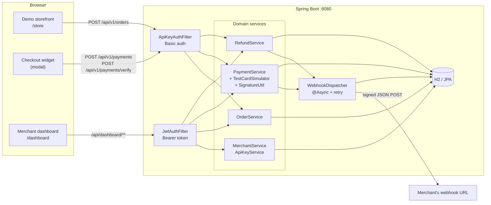
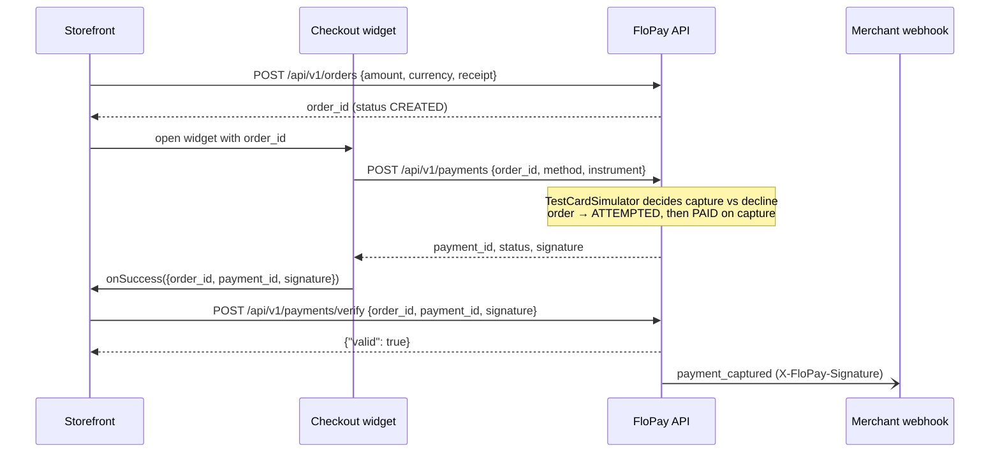
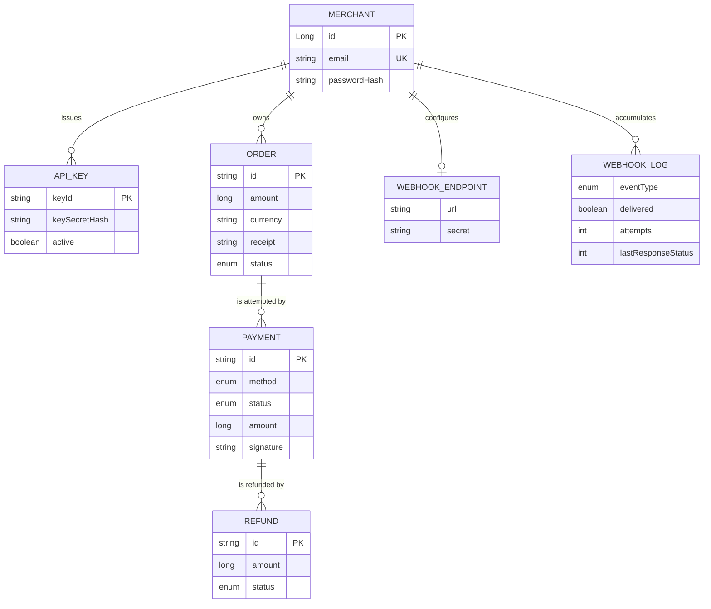

# FloPay

**Payment infrastructure that keeps money in motion.** FloPay is a payment orchestration
platform: one API for cards, UPI and netbanking, covering the full lifecycle
(Orders → Checkout → Capture → Refunds → Webhooks) with HMAC payment signatures, signed
webhook delivery, a premium merchant dashboard, and a demo storefront that exercises the
whole flow in a browser.

Spring Boot (Java 21) + React 19 / TypeScript / Tailwind CSS 4 / Framer Motion.

> **Brand note.** The product, UI and design system are original work. The *API shape* is
> deliberately conventional — Orders, signature verification and signed webhooks follow the
> patterns Stripe and Razorpay popularised, because an integration-focused project is only
> useful if its surface is familiar to the people evaluating it.

---

## What this is — and what it deliberately is not

This project **does not move real money and is not connected to any banking rail, card
network, or UPI system.** Doing that legally requires an RBI payment-aggregator licence and
PCI-DSS certification, which are not available to an individual project. No real card data
is ever accepted — payment "authorization" is a deterministic simulator keyed on well-known
test values, the same way Razorpay's own sandbox test cards behave.

What it *does* replicate faithfully is the part that actually matters to an engineer
integrating a gateway, and the part that is interesting to build:

| Concern | How FloPay handles it |
| --- | --- |
| Two-tier auth | `key_id`/`key_secret` HTTP Basic for the server-to-server API; JWT for the dashboard |
| Secret handling | `key_secret` is BCrypt-hashed at rest and shown exactly once, at creation |
| Order lifecycle | `CREATED → ATTEMPTED → PAID`, amounts in the minor unit (paise) |
| Payment integrity | `signature = HMAC_SHA256("<order_id>\|<payment_id>", key_secret)`, verified server-side |
| Refunds | Full and partial, validated against the captured amount, with over-refund rejection |
| Webhooks | Async delivery, `X-FloPay-Signature` HMAC of the raw body, retries + a delivery log |
| Idempotent-ish reads | Every read is scoped to the authenticated merchant — no cross-tenant access |

---

## Architecture



### The payment flow



The verify step is the whole point of the signature: the widget runs in the browser and is
therefore untrusted, so the merchant's server independently confirms that the
`(order_id, payment_id)` pair was really captured by recomputing the HMAC with the
`key_secret` only it and the gateway know.

---

## Running it

**Prerequisites:** JDK 17–21 and Node 20+.

> ⚠️ Lombok's annotation processor does not yet support JDK 26 internals. If your default
> `JAVA_HOME` points at a newer JDK, the build fails with
> `ExceptionInInitializerError: com.sun.tools.javac.code.TypeTag :: UNKNOWN`. Point
> `JAVA_HOME` at a JDK ≤ 21 for the Maven build.

**Backend** (http://localhost:8080):

```bash
cd backend && ./mvnw spring-boot:run
```

**Frontend** (http://localhost:5173):

```bash
cd frontend && npm install && npm run dev
```

The backend uses an in-memory H2 database, so state resets on every restart. Swap
`spring.datasource.*` in `backend/src/main/resources/application.yml` for a Postgres URL to
persist; the JPA mappings need no changes.

### Demo walkthrough

1. Open **http://localhost:5173/signup** and create a merchant account.
2. Go to **API Keys → Generate new key**. Copy the `key_id` and `key_secret` — the secret is
   shown only this once.
3. *(Optional, to see webhooks)* Go to **Webhooks**, paste a receiver URL
   (e.g. from [webhook.site](https://webhook.site)) and save. A `whsec_…` signing secret is
   generated for you.
4. Open **http://localhost:5173/store**, paste the two key values into the "Connect your
   test keys" panel — this stands in for the credentials a real merchant's backend would hold.
5. Click **Buy Now** → the checkout modal opens against a freshly created order.
6. Pay with the prefilled card `4111 1111 1111 1111`. The storefront shows
   *"Signature verified server-side: yes"*.
7. Back in the dashboard: **Overview** shows the volume and success rate, **Transactions**
   lists the order as `PAID` and the payment as `CAPTURED`, and **Webhooks** shows
   `PAYMENT_CAPTURED` delivered.
8. Hit **Refund** on the payment (blank for a full refund, or an amount in paise for a
   partial one) → the payment becomes `PARTIALLY_REFUNDED` and a `REFUND_PROCESSED` webhook
   fires.

### Test instruments

Authorization is deterministic so demos are reproducible:

| Method | Value | Outcome |
| --- | --- | --- |
| Card | `4111 1111 1111 1111` | Captured |
| Card | `4000 0000 0000 0002` | Failed — *Card declined by issuing bank* |
| Card | anything else | Captured |
| UPI | `failure@flopay` | Failed — *UPI payment declined by customer* |
| UPI | anything else | Captured |
| Netbanking | `FAIL_BANK` | Failed — *Bank server timeout* |
| Netbanking | anything else | Captured |

---

## API reference

All amounts are integers in the currency's minor unit (paise for INR), matching Razorpay.

### Payment API — `Authorization: Basic base64(key_id:key_secret)`

| Method | Path | Purpose |
| --- | --- | --- |
| `POST` | `/api/v1/orders` | Create an order (`amount`, `currency`, `receipt`) |
| `GET` | `/api/v1/orders/{orderId}` | Fetch one order |
| `POST` | `/api/v1/payments` | Attempt payment (`orderId`, `method`, `instrument`) |
| `POST` | `/api/v1/payments/verify` | Verify `orderId` + `paymentId` + `signature` |
| `GET` | `/api/v1/payments/{paymentId}` | Fetch one payment |
| `POST` | `/api/v1/payments/{paymentId}/refund` | Refund, full or partial (`amount`) |
| `GET` | `/api/v1/payments/{paymentId}/refunds` | Refunds for a payment |

### Dashboard API — `Authorization: Bearer <jwt>`

| Method | Path | Purpose |
| --- | --- | --- |
| `POST` | `/api/auth/signup`, `/api/auth/login` | Merchant auth (public) |
| `GET` `POST` `DELETE` | `/api/dashboard/keys[/{keyId}]` | List / issue / revoke API keys |
| `GET` | `/api/dashboard/orders`, `/payments`, `/refunds` | Merchant-scoped read models |
| `POST` | `/api/dashboard/payments/{paymentId}/refund` | Refund from the dashboard UI |
| `GET` `PUT` | `/api/dashboard/webhook` | Read / configure the webhook endpoint |
| `GET` | `/api/dashboard/webhook/logs` | Delivery log |

Errors use a single envelope, and unauthenticated requests get `401` with the same shape:

```json
{ "error": { "code": "BAD_REQUEST", "description": "Refund amount exceeds refundable balance" } }
```

### Identifiers

`flo_test_…` key id · `sk_test_…` key secret · `whsec_…` webhook secret ·
`order_…` · `pay_…` · `rfnd_…`

---

## Webhooks

On capture, failure and refund, the merchant's URL receives a `POST` whose
`X-FloPay-Signature` header is `HMAC_SHA256(raw_body, webhook_secret)` in hex. Events are
`payment_captured`, `payment_failed`, `refund_processed`.

```json
{
  "event": "payment_captured",
  "created_at": "2026-07-29T20:31:33.774332900Z",
  "payload": {
    "id": "pay_sb14US4EZYxig8",
    "orderId": "order_kHd6XC5lNoQqep",
    "method": "CARD",
    "status": "CAPTURED",
    "amount": 249900,
    "signature": "73c3649812582e869a3ffa6437b856f5f7d2a778ba9a7268717ef4d43d3e7c36",
    "failureReason": null,
    "createdAt": "2026-07-29T20:31:33.760713100Z"
  }
}
```

Verify it the way you would a real one — over the **raw** body, before parsing:

```js
const expected = crypto.createHmac('sha256', WEBHOOK_SECRET).update(rawBody).digest('hex');
if (expected !== req.headers['x-flopay-signature']) return res.sendStatus(400);
```

Delivery is off the request thread (`@Async`, dedicated executor) with up to **3 attempts**
and a linear backoff (500 ms × attempt). Every attempt — delivered or not, with the last
response status — is written to `WebhookLog` and surfaced on the dashboard, because a
gateway that silently drops webhooks is indistinguishable from one that never fired them.

---

## Data model



---

## Project layout

### Frontend architecture

```
frontend/src/
  theme/            ThemeProvider — light/dark/system with pre-hydration persistence
  lib/              cn(), money & date formatting, CSV export, shared motion vocabulary
  api/              typed axios clients (JWT + Basic), endpoint layer, wire types
  hooks/            useAsyncResource — request-race-safe fetching primitive
  components/
    ui/             Button, Card, Input, Select, Badge, Modal, Tabs, DataTable,
                    Skeleton, EmptyState, CopyField, AnimatedCounter, StatCard, Toast
    layout/         AppShell, Sidebar, ThemeToggle, PageHeader, ErrorBoundary
    brand/          Logo + FloMark
  features/
    auth/           Zod schemas, AuthContext, login / signup / recovery, RequireAuth
    dashboard/      useDashboardData selectors, RevenueChart, method + activity cards
    payments/       TransactionsPage, RefundModal
    developers/     ApiKeysPage, WebhooksPage
    checkout/       CheckoutWidget — the embeddable hosted-checkout modal
    storefront/     demo product page wiring the widget end to end
```

Design tokens are defined once as CSS variables and mapped into Tailwind via `@theme inline`,
so every utility (`bg-surface`, `text-fg-muted`, `border-line`) flips with the active theme
instead of needing `dark:` variants scattered through the markup. Money is an integer in the
currency's minor unit everywhere it crosses the wire and is only ever rendered through
`lib/format`. Dashboard routes are lazy-loaded so the storefront and auth pages don't pay for
the charting bundle.

### Backend architecture

```
backend/src/main/java/com/flopay/
  merchant/   Merchant + ApiKey entities, signup/login, key issuance & revocation
  order/      Order entity, creation and merchant-scoped reads
  payment/    Payment entity, TestCardSimulator, SignatureUtil (HMAC)
  refund/     Refund entity, full/partial refund validation
  webhook/    WebhookEndpoint, WebhookLog, async signed dispatcher
  security/   ApiKeyAuthFilter, JwtAuthFilter, JwtService, JSON 401 entry point
  config/     SecurityConfig (two filter chains), AsyncConfig, CORS
  common/     ApiException, GlobalExceptionHandler, IdGenerator
```

Two Spring Security filter chains are ordered so `/api/v1/**` is matched first and
authenticated by API key, while everything else falls through to the JWT chain — the same
split real gateways draw between a merchant's server-side credentials and a dashboard
session.

---

## Deliberate simplifications

Called out so they read as decisions rather than oversights:

- **Capture is synchronous.** A real gateway is asynchronous and eventually consistent
  across the acquiring bank; here the outcome is decided in-request so the demo is
  reproducible.
- **No idempotency keys** on order/payment creation. Real gateways require them to make
  client retries safe.
- **JWT secret and H2 credentials live in `application.yml`** for one-command local startup;
  they belong in environment variables or a secrets manager.
- **No rate limiting**, and the dashboard JWT has no refresh-token rotation.
- **The webhook signing secret is displayed in the dashboard** so the demo is
  self-contained. Real gateways show it once.
- **Roles are modelled in the UI but not yet issued by the server.** `AuthContext` types
  `admin | merchant | developer` and `RequireAuth` accepts a role list, but the token carries
  no role claim, so everyone resolves to `merchant`. The gate is ready; the claim is not.
- **Password recovery has no server endpoint.** The form validates and then says so plainly
  rather than showing a fake "check your inbox" screen.
- **Test and live modes are not separated yet.** Every API key behaves as a sandbox key
  (`flo_test_` prefix) and there is no `LIVE` counterpart, so there is nothing to switch
  between and no mode scoping on reads. That is the next block of work.
